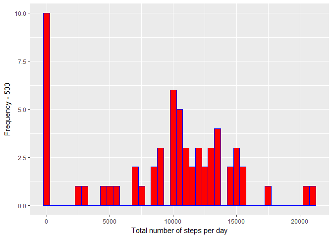
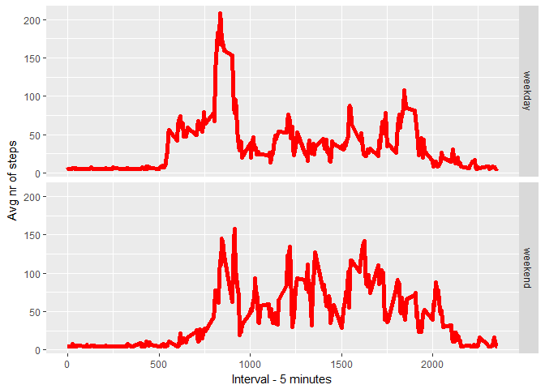

# Reproducible Research: Peer Assessment 1


## Loading and preprocessing the data

```r
if(!file.exists('activity.csv')){
    unzip('activity.zip')
}
data <- read.csv('activity.csv')
```

## What is mean total number of steps taken per day?

```r
nrOfStepsPerDay <- tapply(data$steps, data$date, sum, na.rm=TRUE)
```

### 1. Make a histogram of the total number of steps taken each day

```r
qplot(nrOfStepsPerDay, xlab='Total number of steps per day', ylab='Frequency - 500', binwidth=500)
```

<!-- -->

### 2. Calculate and report the mean and median total number of steps taken per day

```r
nrOfStepsPerDayMean <- mean(nrOfStepsPerDay)
nrOfStepsPerDayMedian <- median(nrOfStepsPerDay)
```
* Mean number of steps per day: 9354.2295082
* Median number of steps per day:  10395

-----

## What is the average daily activity pattern?

```r
avgStepsPerInterval <- aggregate(x=list(stepsMean=data$steps), by=list(interval=data$interval), FUN=mean, na.rm=TRUE)
```

### 1. Make a time series plot

```r
ggplot(data=avgStepsPerInterval, aes(x=interval, y=stepsMean)) +
    geom_line() +
    xlab("Interval - 5 minute") +
    ylab("Avg nr of steps") 
```

<!-- -->

### 2. Which 5-minute interval, on average across all the days in the dataset, contains the maximum number of steps?

```r
stepsMax <- which.max(avgStepsPerInterval$stepsMean)
stepsMaxInterval <-  gsub("([0-9]{1,2})([0-9]{2})", "\\1:\\2", avgStepsPerInterval[stepsMax,'interval'])
```

* Interval with the most steps: 8:35

----

## Imputing missing values
### 1. Calculate and report the total number of missing values in the dataset 

```r
nrOfMissingValues <- length(which(is.na(data$steps)))
```

* Number of missing values: 2304

### 2. Devise a strategy for filling in all of the missing values in the dataset.
### 3. Create a new dataset that is equal to the original dataset but with the missing data filled in.

```r
dataImputed <- data
dataImputed$steps <- impute(data$steps, fun=mean)
```


### 4. Make a histogram of the total number of steps taken each day 

```r
nrOfStepsPerDayImputed <- tapply(dataImputed$steps, dataImputed$date, sum)
qplot(nrOfStepsPerDayImputed, xlab='Total steps per day - Imputed', ylab='Frequency - 500', binwidth=500)
```

<!-- -->

### ... and Calculate and report the mean and median total number of steps taken per day. 

```r
nrOfStepsPerDayMeanImputed <- mean(nrOfStepsPerDayImputed)
nrOfStepsPerDayMedianImputed <- median(nrOfStepsPerDayImputed)
```
* Mean (Imputed): 1.0766189\times 10^{4}
* Median (Imputed):  1.0766189\times 10^{4}


----

## Are there differences in activity patterns between weekdays and weekends?
### 1. Create a new factor variable in the dataset with two levels - "weekday" and "weekend" indicating whether a given date is a weekday or weekend day.


```r
dataImputed$dateType <-  ifelse(as.POSIXlt(dataImputed$date)$wday %in% c(0,6), 'weekend', 'weekday')
```

### 2. Make a panel plot containing a time series plot


```r
avgdataImputed <- aggregate(steps ~ interval + dateType, data=dataImputed, mean)
ggplot(avgdataImputed, aes(interval, steps)) + 
    geom_line() + 
    facet_grid(dateType ~ .) +
    xlab("Interval - 5 minutes") + 
    ylab("Avg nr of steps")
```

<!-- -->
